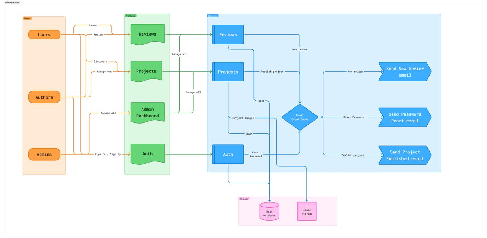
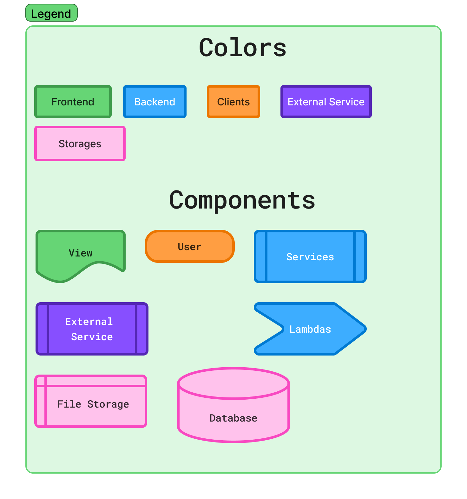

# Proctique Arquitecture
Proctique is a Project Discovery Platform where authors can showcase their work, and users can explore, evaluate, and leave meaningful reviews on published projects. The platform also includes an administrative layer that moderates the community and manages authors, projects, categories, and reviews to ensure a healthy and organized ecosystem.

## Project elements

Clients 
1. Users
2. Authors
3. Admin

Frontends (Views)
1. Reviews
2. Projects
3. Admin Dashboard
4. Auth

Backend
1. Reviews
2. Projects
3. Auth
4. Email Event Queue (Queue)
5. Send New review email (Notification)
6. Send Reset password email (Notification)
7. Send Project published email (Notification)

Storages
1. Main database
2. Image storage (File storage)

## Project Patterns

1. Client–Server
2. Modular monolith
3. Event-Driven (queue)
4. Role-based access control

## Communication

1. Frontend - Backend via Rest API Synchronous
2. Backend - Queue via events Asynchronous
3. Backend - Database Synchronous
4. Backend - Image Storage Synchronous

## Public 

1. Frontend
2. Projects Services
3. Reviews Services
4. Auth Services
5. Image Storage (only Read)

## Internal

1. Email Event Queue
2. Main Database
3. Image Storage
4. Send New Review email
5. Send Password Reset email
6. Send Project Published email

## AuthN and AuthZ

JWT for authentication and Role-Based for Authorization

Roles:

1. Normal User

*Can see published projects and post reviews on projects*

2. Author

*Can manage their own projects (CRUD)*

3. Admin

*Can manage all*

Users (All of them) go to the Login View and there can Sign In or Sign Up to be able to:

- Post Reviews
- Manage Projects
- Manage All (For admin only)

But without signing in, all users can see projects in the public project page

## MVP Diagram

*Legend*

*Note: For MVP we are not going to use any external service* 

*Note: You can review on Figjam [here](https://www.figma.com/board/FaCHliTP4UXuOrhvpX1UHV/M4-HS-Designing-APIs?node-id=32-361)*