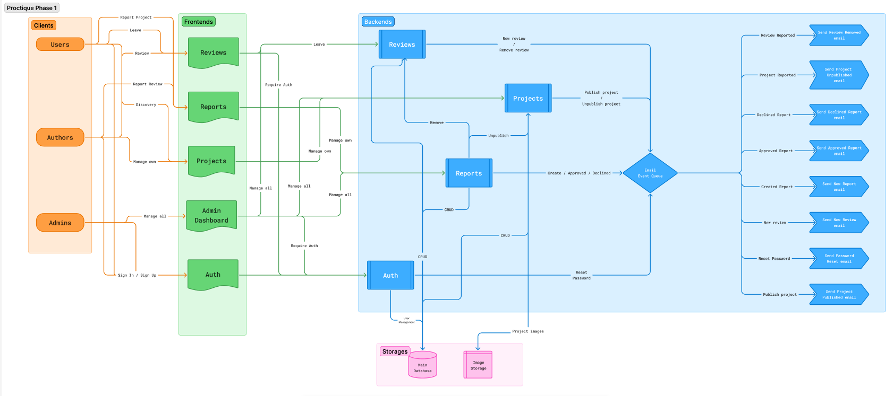
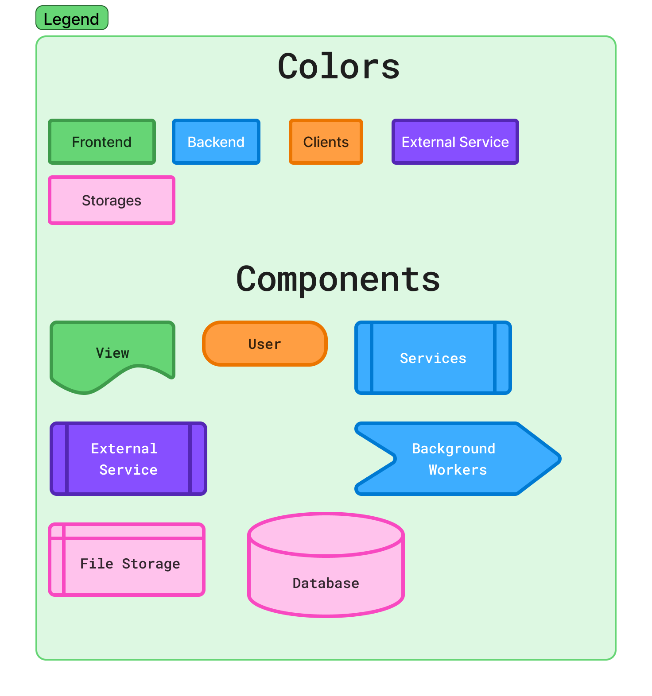

# Phase I

Phase I focuses on making Proctique production-ready by adding moderation, safety, and operational completeness on top of the MVP, without introducing major architectural complexity.

## Additions

### New Backend Capabilities

1. Reports Service
    - Manage reports.
    - Triggers `unpublish project`
    - Triggers `unpublish review`
2. Send Report created email (Notification)
3. Send Report approved email (Notification)
4. Send Report declined email (Notification)
5. Send Project unpublished email (Notification)
    - Sent when the project was reported and the report was approved
6. Send Review deleted email (Notification)
    - Sent when the review was reported and the report was approved

### Backend Structure Changes – Report Handling
In Phase I, the Reports Service will act as the orchestrator when a report is approved.

When an admin approves a report:
- If the report targets a project, the Reports Service will synchronously trigger the Projects Service to unpublish the project.
- If the report targets a review, the Reports Service will synchronously trigger the Reviews Service to hide or delete the review.

This approach ensures immediate consistency between the report decision and content visibility.

#### Pros
1. Simple and easy to reason about.
2. Immediate and predictable behavior (no eventual consistency).
3. Easier to test and debug compared to asynchronous workflows.
4. Reduced infrastructure complexity (no additional workers or event consumers).
5. Well-suited for MVP and Phase I scope.

#### Cons
1. Increased coupling between the Reports Service and content services.
2. The Reports Service takes on orchestration responsibilities.
3. Less flexible if additional side effects (notifications, analytics, audit logs) are introduced later.
4. Harder to scale independently as the system grows.

*For the future: This flow can be migrated to an event-driven model, where approving a report emits a domain event (e.g., ReportApproved) that workers consume to handle content visibility, notifications, and analytics in a more decoupled and scalable way.*

### Frontend Views
1. Report Form
- Allows users to report projects or reviews
2. Admin Moderation Dashboard
- Allows admins to review, approve, or reject reports.

## Why this fits Phase I
- No major architectural changes.
- Reuses existing Role-Based Access Control and queue patterns if needed (notifications).
- Introduces real admin responsibility (moderation).

## Phase 1 Diagram

*Legend*

*Note: For Phase 1 we are not going to use any external service* 

*Note: You can review on Figjam [here](https://www.figma.com/board/FaCHliTP4UXuOrhvpX1UHV/M4-HS-Designing-APIs?node-id=69-151)*