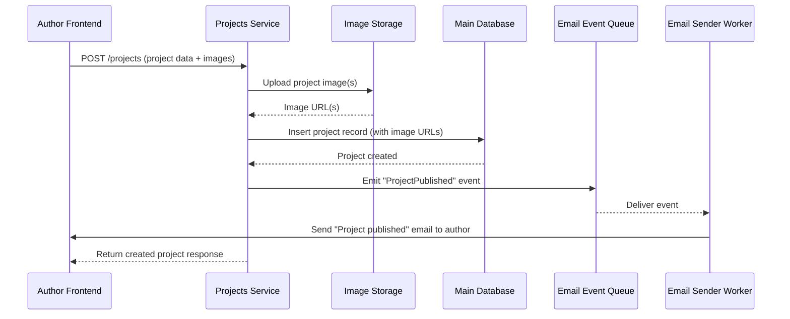
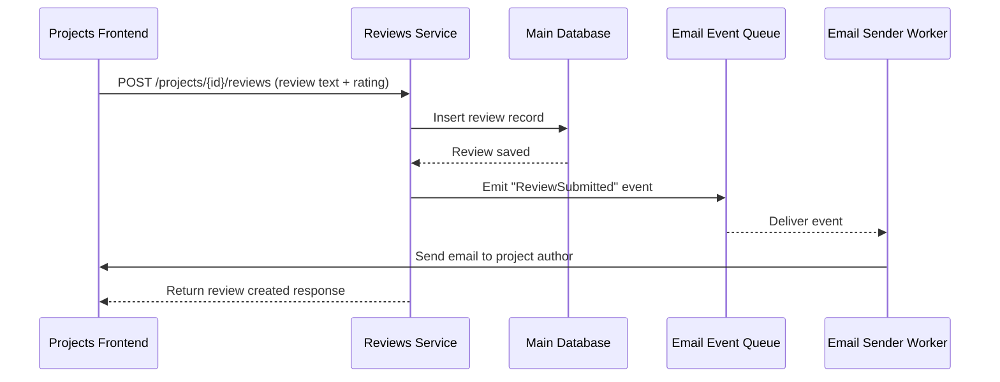
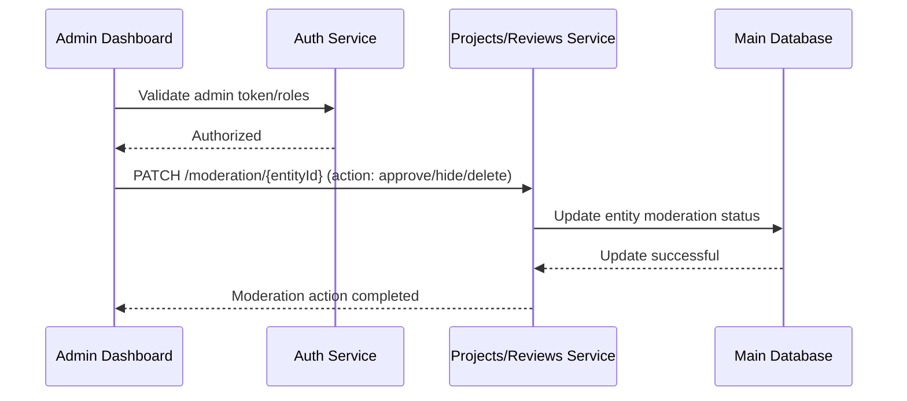
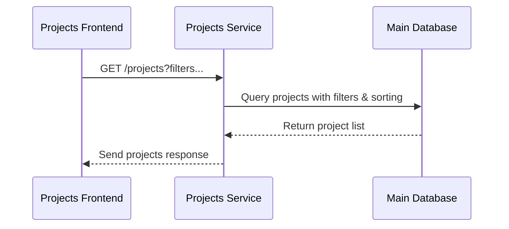

Core User Flows for Proctique

1. User signs up for an account

Involves: Auth Frontend, Auth Service, Main Database
Standard registration flow allowing users to join the platform.

2. User signs in and receives tokens

Involves: Auth Frontend, Auth Service
Authentication flow granting access to protected resources.

3. Author publishes a new project

Involves: Author Frontend, Projects Service, Image Storage, Email Event Queue, Email Sender Worker, Main Database
User uploads project information, optional images, and triggers a “Project Published” email notification.
*Unique flow for this system.*

4. User explores and filters public projects

Involves: Projects Frontend, Projects Service, Main Database
Includes discovery features, search, categories, sorting, etc.

5. User submits a review on a project

Involves: Projects Frontend, Reviews Service, Email Event Queue, Email Sender Worker, Main Database
Posting a review triggers a notification to the project’s author.
*Unique flow for this system.*

6. Author manages their own projects

Involves: Author Frontend, Projects Service, Image Storage, Main Database
Edit, update, and delete own projects.

7. Admin moderates a project or review

Involves: Admin Dashboard, Projects Service, Reviews Service, Auth Service (for roles), Main Database
Admins can approve, hide, or delete inappropriate content.
*Unique flow for this system.*

8. User requests a password reset

Involves: Auth Frontend, Auth Service, Email Event Queue, Email Sender Worker
Standard reset flow.

9. User uploads a project image

Involves: Author Frontend, Projects Service, Image Storage
Direct upload flow tied to publishing or updating a project.

10. Admin creates a new project category

Involves: Admin Dashboard, Projects Service, Main Database
Manages platform-wide taxonomy.

Which flows are unique or special to Proctique?

These flows are not generic authentication flows—they reflect how Proctique handles collaborative project publishing, discovery, and community interactions:
	1.	Publishing a new project (with moderation + email notifications)
	2.	Submitting a review (with author notification)
	3.	Admin moderation workflow for projects and reviews
	4.	Project discovery flow with categories, filters, and ranking

1. Publish Project Flow

2. Submit Review Flow

3. Admin Moderation Flow

4. Project Discovery Flow

